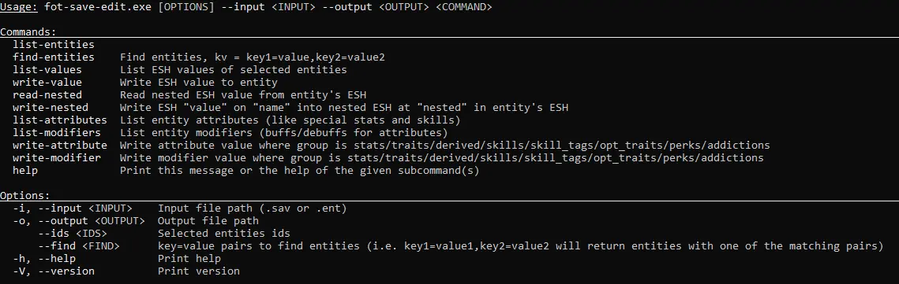
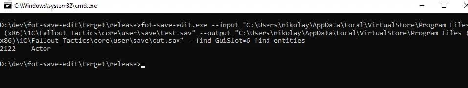
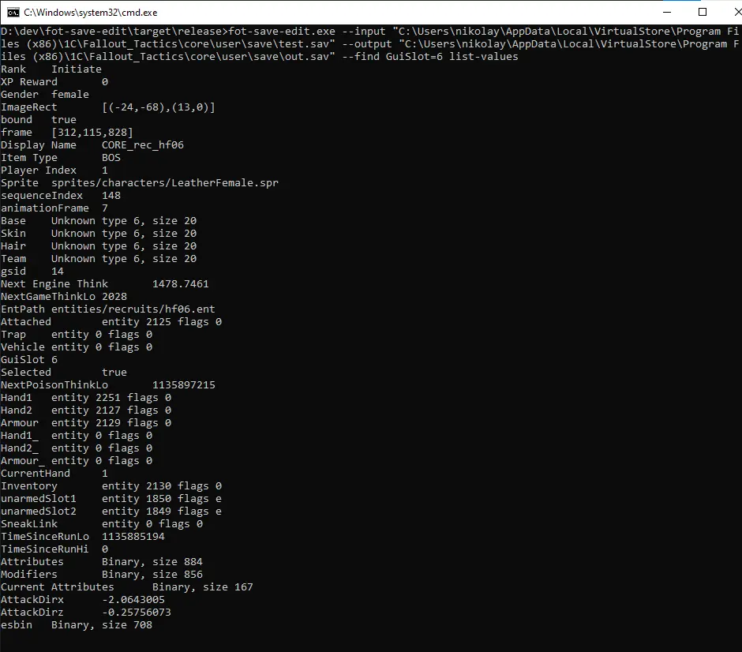
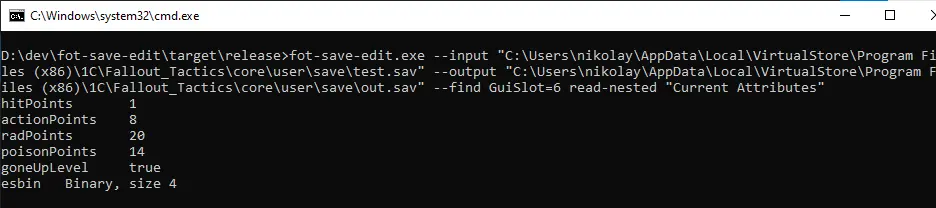
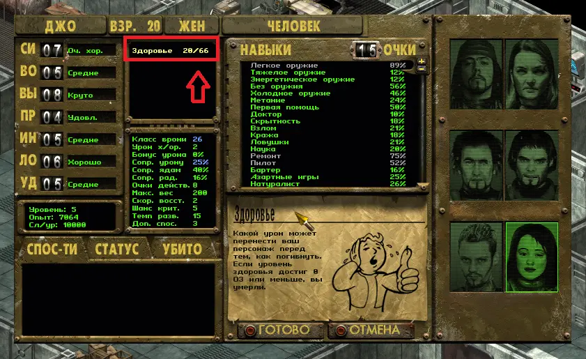
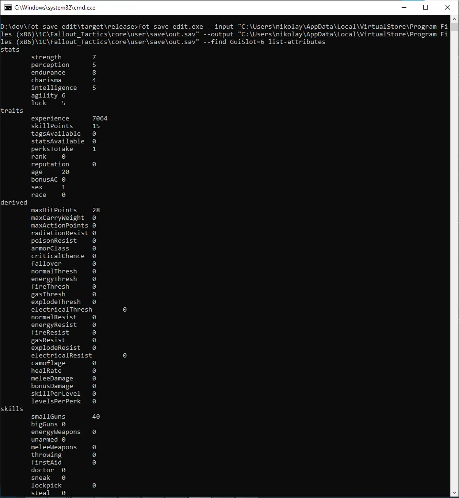
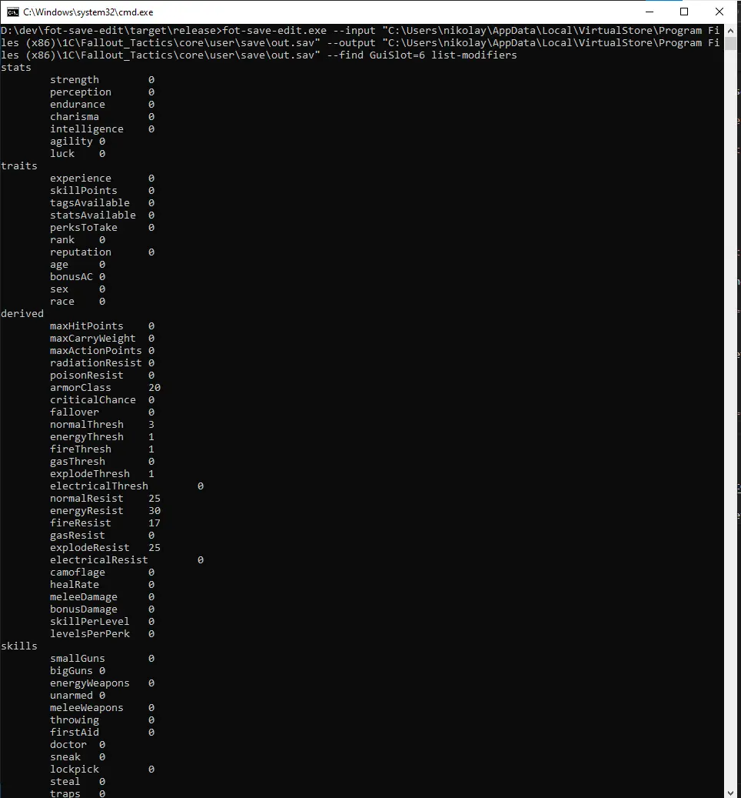
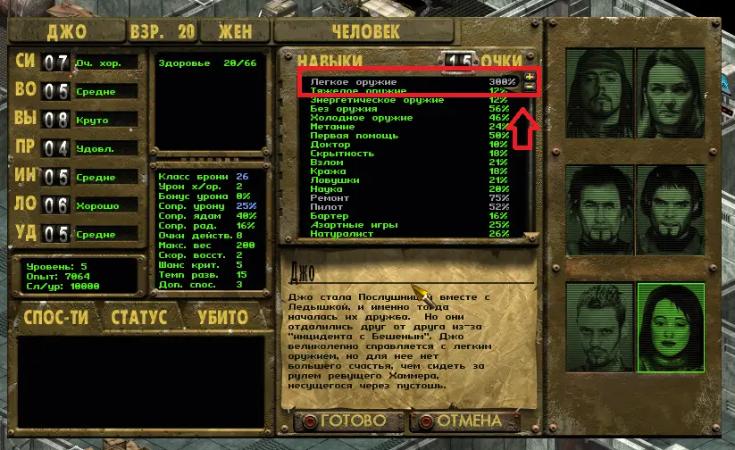

# Fallout Tactics Save Editor
 [](https://www.gnu.org/licenses/gpl-3.0)


**A project for reverse-engineering of Fallout Tactics**

**What can do this software?**

This is CLI (and in future will be GUI) program aimed to decode and encode save files of Fallout Tactics game. Programmatically it implements all of binary format of sav files.

You can use this program to edit stats of any your characters in game, as well of editing properties of entities.

## How to use
Type ```--help``` option to see help



## Example
**The problem**
In my Fallout Tactics playthrough I was unlucky saved at the moment when Jo instantly died from poison being at 1 HP


In this example we will edit Jo character to increase their health, remove poisoning and edit stats and skills, and after all - save her from insta-dying

First of all, there is ```-i``` option where you tell path to .sav file (i.e "C:\Games\Fallout_Tactics\core\user\save\test.sav")

Then there is ```-o``` option which tells output file path, a new edited file save

**Let's begin!**
We nned tofind entity of our player. This can be achieved by ```find-entities``` command with ```--find``` option. 
In ```--find``` option we can entity by value of their properties, for example by slot on the screen


As you can see, Jo is the last one, and the sixth on character panel, so we will select her by ```GuiSlot``` property

The command will be: ```fot-save-edit.exe --input "test.sav" --output "out.sav" --find GuiSlot=6 find-entities```


Excellent! We found her entity ID! Now let's dump her ESH (ESH is entity property values, or Entity Save H...). We can do this using command ```list-values```

So our command will be ```fot-save-edit.exe --input "test.sav" --output "out.sav" --find GuiSlot=6 list-values```


That's a lot of information! But those properties aren't that cool, are they? Maybe some of you saw ```Current Attributes``` property and were curious what can it be, but it says it's just a binary.
Turns out it's a nested ESH, and to read such nested properties we can use ```read-nested```

Our command will be like previous, except ```read-nested``` takes ```name``` of an propery we want to parse.

```fot-save-edit.exe --input "test.sav" --output "out.sav" --find GuiSlot=6 read-nested "Current Attributes"```


Let's remove poisoning from her and restore her health to 20 points

There will be 2 commands:

```fot-save-edit.exe --input "test.sav" --output "out.sav" --find GuiSlot=6 write-nested "Current Attributes" poisonPoints 0```

Note here that we modify already modified out.sav so we won't overwrite new save with older one

```fot-save-edit.exe --input "out.sav" --output "out.sav" --find GuiSlot=6 write-nested "Current Attributes" hitPoints 20```


Here she is! Alive, without poisoning and with 20 hit points we write! Let's buff her small guns skill to 300!

But first let's see her skills (attributes and modifiers)

```fot-save-edit.exe --input "out.sav" --output "out.sav" --find GuiSlot=6 list-attributes```


And modifiers

```fot-save-edit.exe --input "out.sav" --output "out.sav" --find GuiSlot=6 list-modifiers```


On the first screenshot you could see her smallGuns skill is 40, but in game it's 89. What's going on?

Well, game adds derived skill value from special stats. For small guns its calculated in game like this


Now add attribute and modifier values together which is ```40``` and ```0```, if tagged multiply by 2, and add to result initial value which is 5 + (4 * 6) = ```29```, the result will be ```89``` 

To set precise sklll value, we need to calculate it like this - ```new level``` - ```initial value``` - ```20```. For 300 it will be 300 - 29 - 20 = 251

Note here that we need 3 arguments: ```group``` describes group of attribute, currently we need ```skills```, then comes ```name``` of attribute and his ```value```

```fot-save-edit.exe --input "out.sav" --output "out.sav" --find GuiSlot=6 write-attribute skills smallGuns 251```


**This is end of tutorial. I hope this will help you better understand how to work with program and will save you from unlucky save moments**

## Authors

Development and reverse-engineering done by [mykola2312](https://github.com/mykola2312)

Special thanks to [puuuuh](https://github.com/puuuuh) for assisting in reverse-engineering